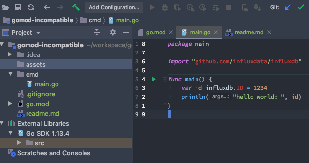

# gomod-incompatibles

## setup
- Open in GoLand
- enable go mod
- it will attempt to resolve dependencies:
```
## Example
GOROOT=/Users/bwagner/go/go1.13.4 #gosetup
GOPATH=/Users/bwagner/go #gosetup
/Users/bwagner/go/go1.13.4/bin/go list -m -json all #gosetup
verifying github.com/influxdata/influxdb@v2.0.0-alpha.1+incompatible/go.mod: github.com/influxdata/influxdb@v2.0.0-alpha.1+incompatible/go.mod: reading https://sum.golang.org/lookup/github.com/influxdata/influxdb@v2.0.0-alpha.1+incompatible: 410 Gone
```
- Which will cause an error if
- We expect to see no syntax highlighting or external libraries added


## build it
- prove that it would work otherwise
```bash
# build
cd cmd
go build

# run it
./cmd

# expected output
hello world:  1234
```
